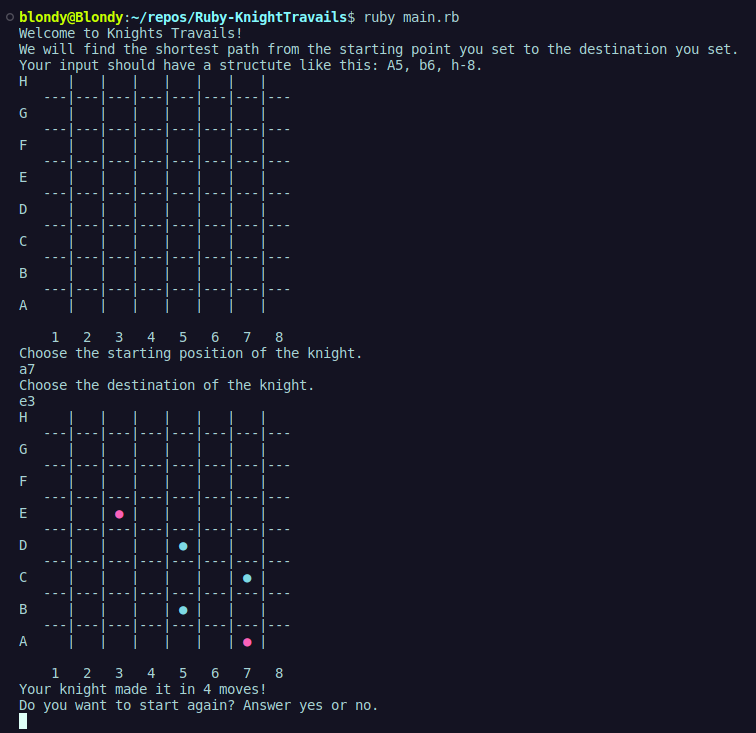

# Knight's Travails 🛡️

Knight's Travails is a Ruby program that finds the shortest path for a knight to move on a chessboard from a given starting position to a destination position using breadth-first search.

## How to Use 🕹️

### Replit
1. Click [replit](https://replit.com/@blondymartinezm/Ruby-KnightTravails)
2. Fork & Run.
   
### GitHub
1. Clone the repository to your local machine.
2. Navigate to the project directory.
3. Run `ruby main.rb` in your terminal.

## Features 🌟

- Finds the shortest path for a knight to move on a chessboard.
- Interactive gameplay.
- Visualization of the knight's moves on the chessboard.
